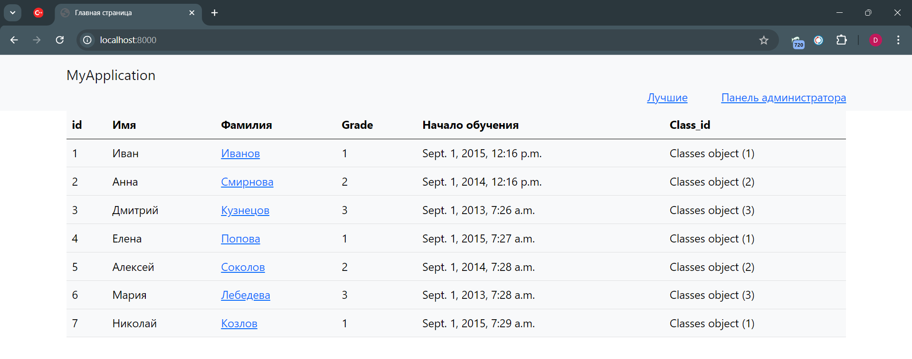
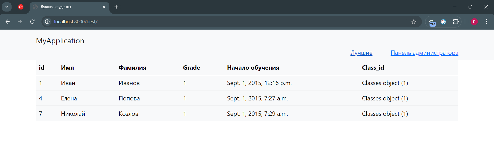
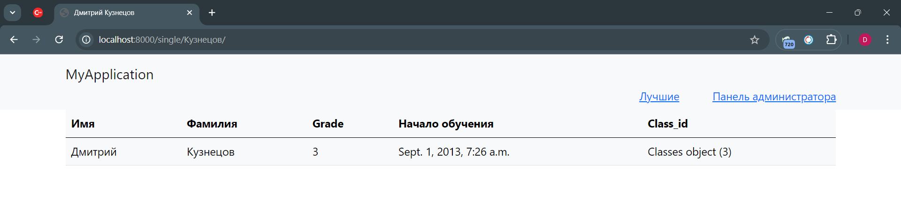
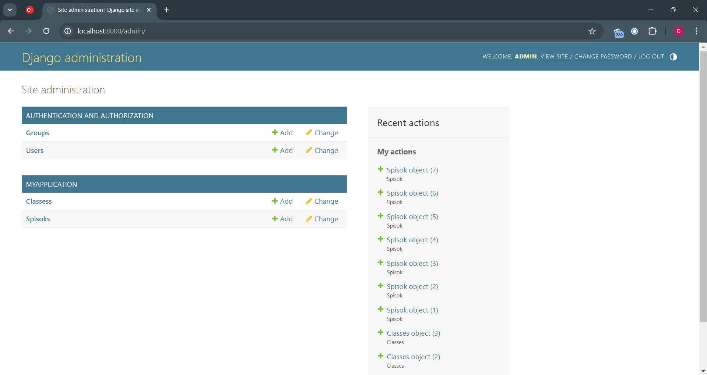

# Задание для тренировки по курсу Python

Задание выполняется по условиям представленного ниже варианта.
Варианты c индивидуальными заданиями представлены в таблице exel: Варианты.xls
Выполненное задание размещается внутри данного репозитория.

## Задание

С помощью фреймворка Django создать сайт-приложение для отображения данных из базы данных(БД).
Сайт состоит из нескольких страниц. На Главной странице сайта выводятся все данные, загруженные в БД(см. рис1).

### Рис 1.

Данные в таблицы БД загрузить вручную с помощью созданной в фреймворке Панели администратора (см рис4)
Также на Главной странице вы должны расположить ссылки для перехода на другие страницы (выделены синим цветом):

- одну ссылку на дополнительную страницу согласно вашего варианта (например лучших студентов) (см рис2), данная ссылка может быть оформлена в виде ссылок внутри таблицы данных (например ссылка на одного студента см рис. 1 и 3)
- ссылку на Панель администратора (см рис4). Самим назначить Логин: admin , Пароль: admin 

### Рис 2.

### Рис 3.

### Рис 4.

Вложенные ресурсы:

Образцы БД по вариантам заданий в формате *.sqlite3 . Эти файлы представлены для описания структуры и содержания таблиц вашего приложения. Название приложения можно оставить как MyApplication, а можно переименовать по вашему желанию.

## Ход выполнения задания (примерный)

1. Организовать начальные настройки, установку пакетов по необходимости и создать проект base.
2. Создать приложение MyApplication + прописать его маршруты + создать superuser(login, password) +все urls.py
3. Создание моделей по образцу БД, которую дали в варианте задания
4. Создание и применение миграций. Подключение приложения в settings.py
5. Добавим записи в таблицы через Панель администратора.
6. Создаем простые обработчики  запросов для маршрутов приложения.
7. Первая пара закончилась.
8. В папке приложения (MyApplication) создаем шаблоны (templates) в html формате
9. Связываем шаблоны с обработчиками. Для каждого из маршрутов используем вложенный файл base.html для упрощения своей жизни. В файле base.html содержится верхняя часть страницы с ссылками на другие страницы (код надо поправить в зависимости от вашего варианта). Используйте QuerySetAPI для выборки нужных значений.
10. Вторая пара закончилась
11. Настроить отображение страниц при переходе по ссылкам, исправить ошибки.
12. Сдача и Защита работы.